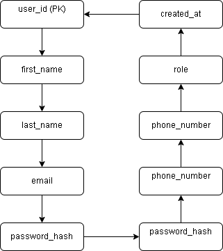

# ER Diagram – Airbnb Database Project

This ERD represents the relationship between the main entities in the Airbnb-like platform.

## 🧱 Entities
- **User**
- **Property**
- **Booking**
- **Payment**

## 🔗 Relationships
- A **User** can act as a host or guest
- A **Host** owns multiple Properties
- A **Guest** can make multiple Bookings
- Each **Booking** is linked to a **Property**
- Each **Booking** has an associated **Payment**

## 📌 Diagram Reference

